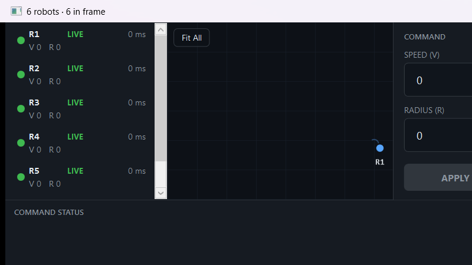
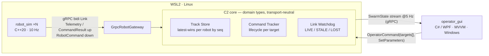

# Emperor C2 — a miniature swarm command & control system

> **GTRI Collaborative Autonomy interview, Question 2.** An interactive C2
> prototype: *N* robot processes stream telemetry to a C2 server that fuses swarm
> state and distributes it to an operator client, which selects robots, issues
> parameter commands, and watches each command's lifecycle land per target — live.

*(The name is a nod to the emperor penguin: a colony that holds tight formation
in a hostile environment and never loses track of one of its own.)*

**What it is, concretely:** *N* `robot_sim` processes (C++20, one robot each,
10 Hz circular-motion telemetry) → a `c2_server` (C++20: **track store**,
**command tracker**, **link watchdog**) → a WPF **operator GUI** (C# / .NET 8).
gRPC runs end-to-end, and the deployment is OS-heterogeneous **by construction**:
the simulation and C2 core run on Linux (WSL2); the operator client runs on
Windows; gRPC crosses the boundary over `localhost`. Read
**[docs/TECH_SPEC.md](docs/TECH_SPEC.md)** for the full design rationale — this
README summarizes and never duplicates it.

---

## Screenshot



> **TODO (Jim):** `polish_preview.png` shows the polished layout (roster ·
> tactical view · command panel · command-status strip, dark theme) but the
> robots are static (V 0 / R 0). Recapture against a **live 6-robot swarm** —
> dots circling, roster populated with real speed/radius/age, and a command's
> chips walking PENDING→SENT→APPLIED in the strip — and drop it in here.

---

## Quickstart

**Prerequisites**
- **WSL2 (Linux)** for the C++ backend: CMake ≥ 3.24, a C++20 compiler, and
  **gRPC 1.82 / protoc v35** (this repo builds against a local install in
  `~/.local`; CI installs the equivalents from `apt`).
- **Windows** for the GUI: **.NET 8 SDK** (`net8.0-windows`), and a NuGet source
  configured (`dotnet nuget add source https://api.nuget.org/v3/index.json -n nuget.org`
  if none exists).

**1 — Build the backend (WSL2):**
```bash
cmake -B build -DCMAKE_PREFIX_PATH=$HOME/.local   # gRPC/protoc live here
cmake --build build --parallel
(cd build && ctest --output-on-failure)           # 18 unit tests, all green
```

**2 — Launch a swarm (WSL2):**
```bash
tools/launch_swarm.sh 6      # server on 0.0.0.0:50051 + 6 robots, then holds until Ctrl-C
```
Expected: `server up ... bound 0.0.0.0:50051`, `6 robots launched`, then a health
check printing 5 `SwarmState` frames — `robots=6`, all `LINK_LIVE`, positions
advancing each frame, `age ~90 ms`. (The script assumes `build/` already exists;
it does not build.)

**3 — Launch the operator GUI (Windows):**
```powershell
dotnet run --project gui\operator_gui -- --grpc
```
Feed selection: `--grpc` (or `EMPEROR_FEED=grpc`) connects to the live server at
`http://localhost:50051`; **default is `Fake`** (a self-contained 6-circle
simulation, so the GUI runs standalone with no server). Expected with `--grpc`:
the six robots appear and orbit; **Fit All** frames them; the roster fills with
status/age/speed/radius.

> The C++ server binds `0.0.0.0` (not `127.0.0.1`) so WSL2's `localhost`
> forwarding reaches it from the Windows client. h2c cleartext HTTP/2.

---

## Architecture



- **`robot_sim` (C++20, ×N):** one robot per process. Owns its motion model
  (`x = x₀ + R·cos(V/R·t + θ₀)`, `y = …sin…`), streams `Telemetry` at 10 Hz,
  applies `SetParameters` (any subset of speed/radius/center/θ — teleporting),
  and reports `CommandResult` up the same bidi stream. Dials out; no inbound
  ports.
- **`c2_server` (C++20):** hosts both gRPC services on one port. Three organs, all
  on **domain types, not protobuf** (see the gateway seam): **Track Store** (the
  question's "common internal data structure": latest state per robot, ordered by
  per-robot seq), **Command Tracker** (per-command per-target lifecycle + the
  fan-out of one operator command into per-robot commands), **Link Watchdog**
  (per-robot LIVE→STALE→LOST on server **receive** time).
- **`operator_gui` (C# / .NET 8 / WPF, MVVM):** subscribes to the `SwarmState`
  stream on a background reader and marshals to the UI thread; roster, tactical
  canvas with trails, multi-select, command panel, and the command-status strip.

**The `OperatorCommand` / `RobotCommand` split** is deliberate: the GUI→C2 seam
carries an `OperatorCommand` with **`targets[]`** (group semantics live in the
C2, one place); the C2→vehicle seam carries only single-target `RobotCommand`s,
so a future MAVLink/DDS adapter never needs to understand groups.

**Custody ≠ delivery:** `SendCommand` returns `Accepted{command_id}` the moment
the C2 takes **custody** of the command; per-target **delivery** outcome
(PENDING→SENT→APPLIED, or a failure) is surfaced afterward through the
`SwarmState.commands` stream — never by failing the RPC.

---

## Key design decisions

- **gRPC for transport** — bidirectional streaming, generated cross-language stubs
  (C++ server, C# client), HTTP/2 across the WSL2/Windows boundary. *Honest
  alternates:* a fielded link is likely **MAVLink** (small-UAS) or **DDS** (ROS 2)
  — both are drawn behind the gateway seam, neither built for a take-home.
- **Sequence numbers, not timestamps, order telemetry** — per-robot `seq` is
  immune to NTP steps / clock adjustments; cross-robot clock comparison never
  happens (single writer per track).
- **Two clocks, never crossed** — the watchdog uses **`steady_clock`** (monotonic
  age can't be corrupted by a wall-clock jump); command timestamps/expiry and
  event times use **`system_clock`** (human-meaningful).
- **Full-state broadcast, not deltas** — correct at this scale (≈20 robots × ~60 B
  × 5 Hz = kilobytes); deltas only pay when state is large and churn is sparse.
  The ratio decides, not habit — deltas + interest management are the documented
  scaling path (§9).
- **WPF, de-risked by a timeboxed spike** — a mature desktop stack fit to this UI;
  new to me, so a Thursday-AM spike with a **named React/TypeScript fallback**
  contained the risk. The spike passed; the fallback wasn't needed.
- **Gateway seam** — generated protobuf types are *not* the domain model; a thin
  `RobotGateway` translates at the edge, so a transport swap touches no track
  store, command logic, or UI.

---

## Verification

- **Unit tests — 18, all green** (`ctest` in `build/`; GoogleTest): motion/proto
  round-trip (`telemetry_test`, 1), track store latest-wins-by-seq + out-of-order/
  duplicate rejection (`track_store_test`, 5), watchdog transitions at exact
  thresholds on receive time (`link_watchdog_test`, 6), command tracker full
  lifecycle + 2-target fan-out + EXPIRED/ROBOT_OFFLINE/retention
  (`command_tracker_test`, 6).
- **Smoke probes** (`tools/`): `subscribe_probe` (reads N `SwarmState` frames,
  used by `launch_swarm.sh`'s health check) and `send_command_probe` (fires one
  `SendCommand` end-to-end — the first command ever driven through the system).
- **Sanitizers:**
  - **ASan + UBSan** on the suite — `cmake -B build-san -DEMPEROR_C2_SANITIZE=ON -DCMAKE_BUILD_TYPE=Debug` — clean.
  - **TSan on the live multi-link server** — `cmake -B build-tsan -DCMAKE_CXX_FLAGS="-fsanitize=thread -g"`, run with a server + robots + subscriber + command. Clean against **our** shared state (track store / watchdog / command tracker / per-link registry). gRPC, Abseil, and protobuf are *not* compiled with TSan, so their internal synchronization is invisible and generates false positives; those third-party frames are suppressed in **[`tsan.supp`](tsan.supp)** (which documents, per entry, why no `c2::` frame is ever matched).
  - `-Wall -Wextra` clean on our targets (never on generated/fetched code).
- **The §5 command lifecycle, demo-verified** (see the demo script): single-target
  radius change → chips walk PENDING→SENT→APPLIED, circle widens · 2-target command
  → per-target chips land independently · STALE robot → PENDING then **EXPIRED** at
  the 10 s validity window · LOST robot → **ROBOT_OFFLINE** immediately · `kill -CONT`
  → recovery to LIVE.
- **CI** (`.github/workflows/main.yaml`): every push, Ubuntu, apt toolchain →
  configure + build + `ctest`. **Scope note:** CI covers the **C++ backend only**;
  the WPF GUI is a Windows/.NET target and is verified by local build + the live
  demo, not by CI.
- **Honest §10 amendment:** the *scripted headless integration suite* the spec
  sketched (server+3 sims orchestrated, asserted programmatically) was
  **deliberately cut** for a take-home. Its beats are covered by the smoke probes
  and the live demo — **the demo is the test.** The design is documented; the
  automation is not built.

---

## Known limitations & next steps

- **No auto-reconnect in the WPF client** — a dropped stream surfaces in the window
  title and stops cleanly; it does not re-dial. (The React exploration below
  *does* demonstrate the reconnect-with-backoff pattern — the intended shape.)
- **Fit All uses a hardcoded viewport size** — window-resize (`ActualWidth/Height`)
  isn't wired into the transform yet; resize then Fit All to reframe.
- **Stretch items, in order** (TECH_SPEC §9): the coasting ghost (STALE robot's dot
  continues its known circle, dashed + age-annotated) · a MapLibre-class map layer
  under the tactical view · a **MAVLink adapter** proving the gateway seam with a
  second real protocol · motion-noise for an honest uncertainty display.
- **Scaling path** — how this prototype becomes a real system (snapshot+delta,
  interest management, attention management, multi-operator authority, current-
  state-vs-history) is designed and documented in **[TECH_SPEC §9](docs/TECH_SPEC.md)**,
  deliberately not built.

---

## `gui/react-spike/` — throwaway exploration (not part of the submission)

A disposable, **AI-assisted** exploration on the `gui-spike-react` branch: a
second, entirely different operator client (React / TypeScript / MapLibre in the
browser, via a small gRPC→WebSocket bridge) driving the **unmodified** C2 server.
It exists only to prove that the `OperatorFeed` API boundary is
client-platform-neutral (TECH_SPEC §9) — labeled as such, never merged to
`master`, and not the deliverable.
