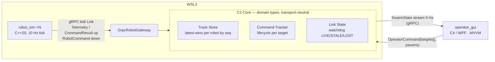

# Emperor C2 Simulation Tech Spec

**Author:** Jim Koch
**Date:** 2026-08-12
**Context:** GTRI Collaborative Autonomy second-level interview, Question 2

---

## 1. Project Objective

Build an interactive miniature C2 system: N simulated robots (one process each) stream telemetry to a C2 server, which fuses swarm state into a common internal structure and distributes it to an operator GUI displaying real-time positions.

The operator selects one or more robots, commands parameter changes, and observes both the effect and the **command's lifecycle** live.

Per the question's Consideration #1, the focus is **visualization, user interface, and communication**. This spec is organized around that priority: the operator experience is the centerpiece; the backend exists to make the operator interaction compelling; and every feature is classified as **Implemented / Stretch / Designed (scaling path)** so scope stays deliberate.

## 2. Requirements (mapped to the question)

1. **Robot simulation process**: circular motion model:
   `x(t) = x₀ + R·cos(V/R·t + θ₀), y(t) = y₀ + R·sin(V/R·t + θ₀)`; one robot per process; N processes with distinct parameters.
2. Each simulator **sends out its current position** continuously.
3. A **C2 server process** listens to all agents, tracks swarm state in a **common internal data structure**, and **sends out the combined state**.
4. A **GUI** displays **real-time locations** of all robots.
5. **Send a command to one robot** changing simulation parameter(s), observable in the GUI. (Extended: multi-target commands — optional suggestion #4.)
6. **Demonstrate the interactive simulation** live.
7. Communication method, languages, and libraries are mine to choose and defend.

## 3. Operator Experience (the centerpiece)

### Layout

```
┌──────────────────────────────────────────────────────────────────────┐
│ SWARM C2                                    5 LIVE · 1 STALE · 0 LOST│
├──────────────┬───────────────────────────────────┬───────────────────┤
│ ROSTER       │                                   │ SELECTED: R-03    │
│              │          TACTICAL VIEW            │ Status: LIVE      │
│ ● R-01 LIVE  │                                   │ Age: 40 ms        │
│ ● R-02 LIVE  │        ● R-01    ↗ R-03           │ Speed: 12 m/s     │
│ ◉ R-03 LIVE  │      ·····trail·····              │ Radius: 100 m     │
│ ● R-04 LIVE  │              ● R-04               │                   │
│ ◌ R-05 STALE │         ◌ R-05 (age 3.2s)         │ COMMAND           │
│ ● R-06 LIVE  │                    ● R-06         │ Speed  [ 15  ]    │
│              │   [Fit All] [Follow]              │ Radius [ 150 ]    │
│              │                                   │ APPLY TO 1 ROBOT  │
├──────────────┴───────────────────────────────────┴───────────────────┤
│ CMD 0418 → R-03  radius 150   APPLIED  15:18:03                      │
│ CMD 0417 → R-01,R-02  speed 15   R-01 APPLIED · R-02 PENDING         │
└──────────────────────────────────────────────────────────────────────┘
```

### Behaviors (each maps to optional considerations 1, 4, 5)

- **Tactical view:** robots as dots with heading ticks and fading trails; labels; pan/zoom; **Fit All**; **Follow selected**. Grid + scale reference.
- **Roster:** ID, link status, telemetry age, current speed/radius. Selection from roster *or* map stays in sync. Stale/lost robots are surfaced **here**, visibly — an operator must never have to notice a missing dot.
- **Selection model:** click = single; Ctrl-click = additive; selection drives the command panel's target set.
- **Command panel:** shows the selected robot's *current* values as the starting point; edits + APPLY; the button states its scope explicitly ("APPLY TO 3 ROBOTS").
- **Command status strip:** every issued command appears with its live lifecycle per target (see §5) — the operator always knows whether it worked. This is the difference between a dashboard and a C2 system: issuing a command is not sufficient; the UI must expose its outcome, per target.
- **Status bar:** swarm-level counts (LIVE/STALE/LOST) — glanceable health, and the seed of exception-based supervision (§9, Attention management).

## 4. Architecture



- **`robot_sim` (C++20, ×N):** evolved from my existing TSan-verified gRPC bidi client. Owns its motion model; streams `Telemetry` at 10 Hz; applies `SetParameters` (any subset of V, R, center, θ — teleporting per Consideration #1); reports `CommandResult` (applied/rejected) up the same stream. Vehicle dials out — no inbound ports.
- **`c2_server` (C++20):** evolved from my existing goose server (weak_ptr registry with atomic lookup, per-link reader/writer threads, stop_token shutdown — all pre-verified under TSan). Three core organs, all operating on **domain types, not protobuf types** (§6):
  - **Track Store** — the question's "common internal data structure": latest state per robot, **ordered by per-robot sequence number** (see Protocol).
  - **Command Tracker** — lifecycle state per command per target (§5), including the **fan-out** of operator commands into per-robot commands.
  - **Link State** — per-robot watchdog on **server receive time**: LIVE → STALE → LOST.
- **`operator_gui` (C# / .NET 8 / WPF):** Windows-native operator client, subscribing to the SwarmState stream; MVVM (ObservableCollection of robot VMs; Canvas ItemsControl for the tactical view; commands via `OperatorFeed`). **Why Windows-native:** the current SOI is deployed on Windows (confirmed in discussion with the team — "at the moment," a phrase that itself argues for a clean client seam, see §9). **Why WPF:** a mature, deeply documented desktop framework well-suited to exactly this UI's needs — tactical canvas, data binding, selection, status visualization, command controls. WPF is new to me, so risk is contained by a **timeboxed Thursday-morning spike** with a **named fallback** — a TypeScript/React web UI (my fluent stack; also a live pattern in modern defense GCS work) that executes without renegotiation if the spike fails. Either outcome is defensible; only an untimeboxed adventure is not.
- **The deployment topology is itself a demonstration:** simulation and C2 core run on Linux (WSL2); the operator client runs on Windows; gRPC crosses the OS boundary cleanly over localhost. The comms architecture is OS-heterogeneous by construction — which mirrors fielded reality.

### Protocol (`robot.proto`, evolved from my goose.proto)

- `Telemetry`: robot_id, **seq** (per-robot, monotonically increasing), timestamp (event time, for display/debugging), x, y, heading, speed, radius.
  - **Ordering & duplicate rejection use `seq`, not timestamps.** Latest-wins never compares clocks *across* robots (single writer per track), but timestamp ordering would still depend on each robot's clock being monotonic — NTP steps and clock adjustments break that. A sequence number is immune. Server-side **receive time** (monotonic clock) drives `age_ms` and the STALE/LOST watchdog, so link health never depends on any robot's clock at all.
- **`OperatorCommand`** (GUI → C2 seam): command_id, timestamp, expiry, **targets[]** (robot_ids), oneof payload { `SetParameters` }. Multi-targeting is **C2 semantics**: the Command Tracker fans an operator command into per-robot commands.
- **`RobotCommand`** (C2 → vehicle seam): command_id, timestamp, expiry, **single robot_id**, payload. The vehicle protocol never sees group semantics — which keeps a future MAVLink/DDS gateway honest (§6).
- `CommandResult`: command_id, robot_id, result (APPLIED / REJECTED), detail.
- Uplink is `oneof { Telemetry, CommandResult }` — one stream, two message kinds, the goose pattern unchanged.
- `SwarmState`: seq, server time, repeated `RobotState` { telemetry, link_status, age_ms }, repeated `CommandStatus` { command_id, per-target states }.
- Services: `RobotLink.Link(stream Uplink) returns (stream RobotCommand)`; `OperatorFeed.Subscribe(...) returns (stream SwarmState)`; `OperatorFeed.SendCommand(OperatorCommand) returns (Accepted)`.

## 5. Command Lifecycle (implemented core)

A C2 operator must know, per command, per target, whether it worked:

```
PENDING → SENT → APPLIED
            ↘ REJECTED / EXPIRED / ROBOT_OFFLINE
```

- **PENDING:** accepted by the server; target link not yet written.
- **SENT:** written to the robot's stream.
- **APPLIED:** robot's `CommandResult` received and positive.
- **REJECTED:** robot refused (bad params).
- **EXPIRED:** validity window passed with no result — stale commands must die, not execute late. (A SENT command can expire: delivery to a stalled link can succeed at the transport layer while the process never runs.)
- **ROBOT_OFFLINE:** target already LOST at dispatch time — surfaced immediately, no send attempted.
- Multi-target commands aggregate per-target states in the GUI status strip.
- *Fielded note:* real vehicle protocols distinguish more states — received, accepted, execution-in-progress, final completion. This simulator collapses ack and apply into one `CommandResult`, so the implemented machine is the honest three-state version; the tracker's design accommodates the finer ladder.

This one feature demonstrates communication, operator feedback, failure handling, multi-robot commands, and UI/UX — the question's focus, in one mechanism: command identity + expiry + explicit per-target result, made operator-visible.

## 6. The Gateway Seam (transport-neutral C2 core)

**Generated protobuf classes are not the C2 domain model.** The core operates on plain domain types (`RobotTelemetry`, `RobotCommand`, `CommandResult`, `RobotId`, …); a thin **`RobotGateway`** boundary translates. One adapter is implemented — `GrpcRobotGateway`. Two are drawn — `MavlinkRobotGateway`, `DdsRobotGateway` — because a fielded link is likely MAVLink (the small-UAS standard) or DDS (ROS 2 stacks), and often both (DDS onboard, MAVLink on the radio). The seam means a fielded transport swap touches no track store, command logic, or UI — and because vehicles receive only single-target `RobotCommand`s (§4), no adapter ever needs to understand group semantics. *(Same principle as rendering inside a host map's pipeline: put the seam where the world changes.)* Deliberately **not** built: a generic byte-transport interface — abstraction without a second consumer.

## 7. Telemetry vs Command Semantics (explicit principle)

- **Telemetry:** high-rate, continuously superseded → latest-wins, bounded queues, coalescing for slow consumers (a laggy GUI gets 10 → 50, not 10,20,30,40,50). Dropping stale positions is correct behavior.
- **Commands:** low-rate, individually significant → identified, expiring, deduplicated, acknowledged, auditable. Never coalesced, never silently dropped.

Two data species, two disciplines — a distinction I first built at NCR (Pay Once: effectively-once financial transactions over unreliable links) and have carried through every C2-shaped system since.

## 8. Link Loss & Coasting (stretch — after core operator workflows)

- **Implemented core includes** the watchdog + status surfacing (LIVE/STALE/LOST in roster, ages, alerts) — that's operator-assist fundamentals.
- **Stretch:** the coasting ghost — a STALE robot's dot continues its known circle (the server knows the motion model), dashed/gray, annotated with **telemetry age** (honest label — a deterministic sim has no statistical uncertainty to draw; if time permits, injecting motion noise per Consideration #3 would make a true uncertainty region meaningful — noted, not promised).
- **Demo mechanism** either way: `kill -STOP` / `kill -CONT` a robot process live — the state machine narrates itself.

## 9. Scope: Implemented / Stretch / Designed

**Implemented (because it demonstrates the question):**
1) N robot processes
2) gRPC transport behind the gateway seam
3) track store + link watchdog
4) command lifecycle with per-target status
5) WPF operator UI (tactical view, roster, selection incl. multi-select, command panel, status strip, Fit All/Follow)
6) integration tests + sanitizers + CI

**Stretch (ordered):**
1) coasting ghost + age annotation
2) MapLibre-style map layer under the tactical view (Consideration #2 — welcomed, not required; the sim's planar frame maps to a configured origin as local E/N offsets)
3) MAVLink adapter proving the gateway seam with a second real protocol
4) motion-noise injection making uncertainty display honest

### The scaling path

How this prototype evolves into a real system — **designed, deliberately not built.** The shape follows a full GCS design exercise I completed during interview prep.

- **Snapshot + delta with sequence recovery** — full-state broadcast is *correct* at 20 robots × ~60 B × 5 Hz (kilobytes); deltas pay when state is large and churn is sparse (thousands of rich tracks, constrained links). **The ratio decides, not habit:** the ratio of *state that changed per tick* to *total state size*. When most of the state changes every tick (20 robots all moving), a delta is nearly as big as the snapshot — and adds sequencing, gap-detection, and resync complexity for nothing. Deltas only earn that complexity when the changed fraction is small (thousands of tracks, few moving) or the link is expensive.
- **Interest management** — operators subscribe by viewport / mission / group and the distribution layer filters, so each client receives only the state it can act on. At scale this matters more than deltas. The natural implementation is **topic-based pub/sub with content filtering**: DDS does this natively (topics + content-filtered subscriptions), and it's what the "subscribe" language points at; a spatial (viewport) filter is a content filter over position, and a spatial index (grid/quadtree) on the server makes it cheap. `SubscribeRequest` is reserved for exactly these filters.
- **Attention management** — at large swarm sizes, operators supervise **by exception** rather than inspecting every track: alerts, link loss, failed commands, mission deviations, and control conflicts are prioritized and surfaced independently of map visibility. **The evaluation belongs on the C2 server, not the client:** the server holds authoritative state (every client must agree on what's alerting; a laggy or compromised client can't miss a violation), alerts need persistence, ack-by-whom, and audit, and severity/escalation is a *policy*, not view logic. The client renders and acknowledges; it doesn't decide. The status bar and command status strip are the seeds of this.
- **Level of detail** — aggregate clusters zoomed out, full annotation zoomed in; the GPU-backed view renders tracks, the UI framework renders workflow.
- **Group command semantics** — `targets[]` today; groups + dynamic selections ("all UAVs in Sector 4") + per-command aggregation ("213 applied / 3 pending / 1 offline") tomorrow. The OperatorCommand/RobotCommand split (§4) is where that grows.
- **Multi-operator authority** — identity, ownership/leases, handoff, break-glass + audit; the *backend* is authoritative for who may command an asset, never the client. (A consensus problem, not a convergence problem — ownership cannot LWW-merge.)
- **Time across machines** — the command tracker's expiry sweep compares a GUI-stamped wall-clock deadline against the server's wall clock, so a clock step or a GUI↔server offset could expire a command early or late. Production carries a **relative TTL** anchored to the receiver's monotonic clock — the same move the watchdog already makes for liveness — and, where fielded systems truly need shared absolute time (sensor fusion, coordinated maneuvers), bounds clock error explicitly (PTP / GNSS-disciplined clocks, or an interval-valued clock à la TrueTime) rather than assuming it away.
- **Current state vs history** — the tactical UI wants latest state; audit / AAR / replay want the event log. Different data problems, different stores.
- **Distributed ingest / distribution** — per-protocol gateways → normalized events → authoritative state → filtered distribution; the "common data structure" stays logically common without being one map in one process.
- **Client-platform independence** — the operator API boundary (SwarmState stream + SendCommand) is UI-framework-neutral by construction; a web client (React/TypeScript + a map layer) attaches without touching the C2 core — the throwaway `gui/react-spike` proves it. Today's deployment is Windows "at the moment" — deployment realities shouldn't become architecture commitments, and this seam is what keeps them from doing so.

## 10. Verification Plan

- **Unit:**
  - motion model (position at known t; parameter application; teleport asserted as spec'd)
  - track store (latest-wins **by per-robot seq**; out-of-order and duplicate telemetry rejected; robot timestamp never consulted for ordering)
  - watchdog transitions at exact thresholds, driven by **server receive time**
  - command tracker (full lifecycle; fan-out of a 2-target OperatorCommand into 2 RobotCommands; EXPIRED and ROBOT_OFFLINE paths)
  - SwarmState assembly (seq monotonic; all robots present)
- **Integration (headless):**
  - server + 3 sims → 3 LIVE
  - SIGSTOP one → STALE → LOST at thresholds; CONT → LIVE
  - SetParameters to 2 targets → both telemetry streams reflect it and both report APPLIED
  - **STALE-robot command:** SIGSTOP a robot past T_stale but before T_lost → command it → transport write may succeed (kernel buffers) but no result returns → **EXPIRED** at the validity window
  - **LOST-robot command:** SIGSTOP past T_lost → command it → **ROBOT_OFFLINE** immediately, no send attempted
- **Sanitizers:**
  - TSan on multi-link server paths (suppression file exists)
  - ASan/UBSan on the suite. `-Wall -Wextra` clean
- **GUI:**
  - build-verified in CI (windows runner)
  - behavior verified by the demo script — honest scope for the week.

## 11. Demo Script

1. Launch server + 6 robots (varied params) — swarm circling live; roster and status bar populated.
2. Select R-03 → radius 150 → APPLY → circle widens; status strip walks PENDING → SENT → APPLIED.
3. Ctrl-select R-01 + R-02 → speed change → "APPLY TO 2 ROBOTS" → per-target statuses land independently.
4. `kill -STOP` R-05 → roster flips STALE with climbing age (+ ghost, if stretch landed) → LOST alert → command it → ROBOT_OFFLINE surfaces → `kill -CONT` → snap to truth, LIVE again.
5. Fit All / Follow tour; close on the scaling-path diagram: "here is how this prototype becomes the real system."

## 12. Schedule (within the take-home window)

- **Wed pm (today):**
  - this spec (final)
  - repo skeleton on the Q1 CMake/CI pattern
  - `robot.proto` compiling on the C++ side
- **Thu am:** **WPF spike, timeboxed to midday** — proto into C#, one window, dots moving from live server data. Pass → WPF confirmed; fail → fallback executes, no renegotiation.
- **Thu pm:** backend complete — gateway, track store, watchdog, command tracker (incl. fan-out), operator feed, launcher; integration tests green.
- **Fri:** GUI completion (selection, command panel, status strip, roster, Fit All/Follow) · stretch items in order if green · Q1 deferred items (V1 Hausdorff, V3, figure polish, main.cpp wiring) · READMEs · demo dry run.
- **Sat: rest (non-negotiable).**
- **Sun:** mock defense — committee role-play, both questions, screen-share rehearsal. **Mon 10:00 ET:** review.